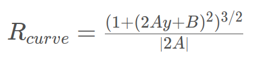

## **Advanced Lane Finding Project**


The goals / steps of this project are the following:

* Compute the camera calibration matrix and distortion coefficients given a set of chessboard images.
* Apply a distortion correction to raw images.
* Use color transforms, gradients, etc., to create a thresholded binary image.
* Apply a perspective transform to rectify binary image ("birds-eye view").
* Detect lane pixels and fit to find the lane boundary.
* Determine the curvature of the lane and vehicle position with respect to center.
* Warp the detected lane boundaries back onto the original image.
* Output visual display of the lane boundaries and numerical estimation of lane curvature and vehicle position.

[//]: # (Image References)

[image1]: ./output_images/check_undistortion.png "Undistorted"
[image2]: ./output_images/test1_undist.png "Road Transformed"
[image3]: ./output_images/test1_gradient.png "Binary Example"
[image4]: ./output_images/warp.png "Warp Example"
[image5]: ./output_images/window.png  "Sliding Windows"

[image6]: ./output_images/pipeline_out.png "Output"
[video1]: ./project_video.mp4 "Video"

## [Rubric](https://review.udacity.com/#!/rubrics/571/view) Points

### Here I will consider the rubric points individually and describe how I addressed each point in my implementation.  

---

### Writeup / README

#### 1. Provide a Writeup / README that includes all the rubric points and how you addressed each one.  You can submit your writeup as markdown or pdf.  [Here](https://github.com/udacity/CarND-Advanced-Lane-Lines/blob/master/writeup_template.md) is a template writeup for this project you can use as a guide and a starting point.  

You're reading it!

### Camera Calibration

#### 1. Briefly state how you computed the camera matrix and distortion coefficients. Provide an example of a distortion corrected calibration image.

The code for this step is contained in the first cells of the IPython notebook located in "./adv_finding_lane.ipynb".  

I start by preparing "object points", which will be the (x, y, z) coordinates of the chessboard corners in the world. Here I am assuming the chessboard is fixed on the (x, y) plane at z=0, such that the object points are the same for each calibration image.  Thus, `objp` is just a replicated array of coordinates, and `objpoints` will be appended with a copy of it every time I successfully detect all chessboard corners in a test image.  `imgpoints` will be appended with the (x, y) pixel position of each of the corners in the image plane with each successful chessboard detection.  

I then used the output `objpoints` and `imgpoints` to compute the camera calibration and distortion coefficients using the `cv2.calibrateCamera()` function.  I applied this distortion correction to the test image using the `cv2.undistort()` function and obtained this result: 

![alt text][image1]

### Pipeline (single images)

#### 1. Provide an example of a distortion-corrected image.

To demonstrate this step, I will describe how I apply the distortion correction to one of the test images like this one:
![alt text][image2]

#### 2. Describe how (and identify where in your code) you used color transforms, gradients or other methods to create a thresholded binary image.  Provide an example of a binary image result.

I used a combination of color and gradient thresholds to generate a binary image (see section titeled  "Using Thresholding").  Here's an example of my output for this step.  
![alt text][image3]

#### 3. Describe how (and identify where in your code) you performed a perspective transform and provide an example of a transformed image.

The code for my perspective transform includes a function called `warp_perspective()`(section "Perspective Transform" of the IPython notebook).  The `warper()` function takes as inputs an image (`img`), as well as source (`src`) and destination (`dst`) points.  I chose the hardcode the source and destination points in the following manner:

```python
src = np.float32(

# specify corners 
top_left = (573, 466)
top_right = (710, 466)
bottom_right = (1115, 720)
bottom_left = (205, 720)
# define 4 source points for the perspective transform
src = np.float32([list(top_left),list(top_right),list(bottom_left),list(bottom_right)])

# define 4 destination points for the perspective transform
dst = np.float32([[250,0],[995,0],[250,720],[995,720]])
```

I verified that my perspective transform was working as expected by drawing the `src` and `dst` points onto a test image and its warped counterpart to verify that the lines appear parallel in the warped image.

![alt text][image4]

#### 4. Describe how (and identify where in your code) you identified lane-line pixels and fit their positions with a polynomial?

The lane pixels are identified in the section "Detecting Lane Lines" of the Notebook using a sliding window algorithm with 9 windows as shown below. 
The function "fit_plonomial()" fits a polynomial to the found lane pixels (blue and red).

![alt text][image5]

#### 5. Describe how (and identify where in your code) you calculated the radius of curvature of the lane and the position of the vehicle with respect to center.

The radius of the curvature is calculated using the function "measure_curvature_real()".
The curvature is calculated as :


The distance to the center of the road is calculated by substracting the middle point between the found lanes from the center of the image:
```python
distance_to_center = (image.shape[1]/2 - (leftx[0] + rightx[0])/2) * xm_per_pix
```


#### 6. Provide an example image of your result plotted back down onto the road such that the lane area is identified clearly.

The calculated lane positins are the transformed back to the original perspective.

![alt text][image6]

---

### Pipeline (video)

#### 1. Provide a link to your final video output.  Your pipeline should perform reasonably well on the entire project video (wobbly lines are ok but no catastrophic failures that would cause the car to drive off the road!).

Here's a [link to my video result](./output_videos/project_video.mp4)

---

### Discussion

#### 1. Briefly discuss any problems / issues you faced in your implementation of this project.  Where will your pipeline likely fail?  What could you do to make it more robust?

The robustness of the implemented pipeline can be improved by averaging the calculated lane points over many frames.
For the harder challenge video the pipeline fails to find the lanes.
